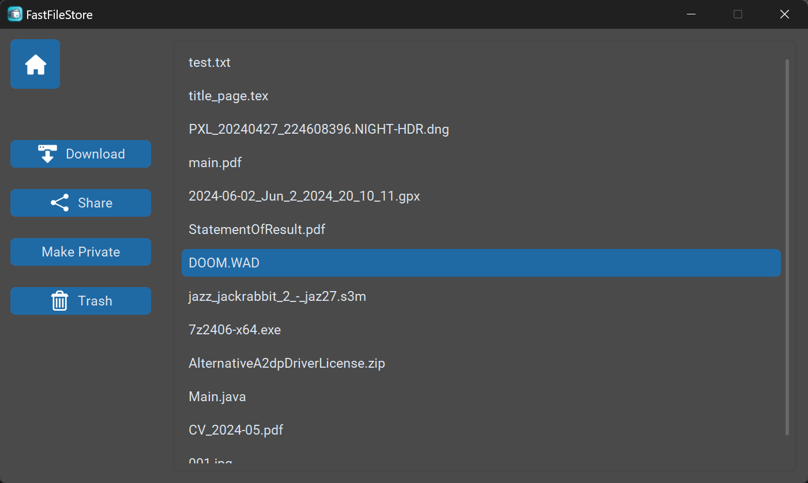

# FastFileStore 

FastFileStore is a minimal user-friendly application for uploading, downloading and sharing files with other users. Built with Python using the CustomTkinter library, it provides a seamless experience for managing your files with additional features like user accounts, file sharing, and a trash system that automatically deletes files after 30 days.

## Backend Server

This repository contains the frontend application of FastFileStore. The backend server, which handles all the server-side operations such as database management and file storage, is available in a separate repository. You can find it [here](https://github.com/JanSzyndlarewicz/FFS-API).

## Features

- **User Accounts:** Securely create user accounts.
- **File Uploading:** Easily upload files through the app.
- **File Sharing:** Share files with other users seamlessly.
- **Password Protection:** When uploading, protect your files with passwords. This will cause the downloaded file to come in a password-protected ZIP file.
- **Download Files:** Download your files anytime, anywhere through links, QR codes or through the app.
- **Trash Bin:** Deleted files are moved to a trash bin and are permanently deleted after 30 days.

## Screenshots

Login screen where users can enter their credentials.


<br>
Main menu where users can access all the functionalities.


<br>
Interface for uploading files.


<br>
Upload confirmation screen with a QR code leading to the download URL.


<br>
'My Files' view where users can view their previously uploaded files and manage them.



<br>
'Shared Files' screen where users can view files shared with them by other users.


<br>
Trash bin where deleted files are stored for 30 days.


## Installation

To run the FastFileStore app locally, follow these steps:

1. **Clone the repository:**
   ```bash
   git clone https://github.com/therockey/FFS-GUI.git
   cd FFS-GUI
   ```
2. **Create and activate a virtual environment (optional but recommended):**
   ```bash
   python -m venv venv
   source venv/bin/activate  # On Windows use `venv\Scripts\activate`
   ```
3. **Install the required dependencies:**
   ```bash
   pip install -r requirements.txt
   ```
4. **Set the backend server URL:**
   - Open the `prefs.py` file.
   - Set the `API_URL` variable to the URL or IP of the backend server.
   ```python
   preferences = {
    "SETTINGS_DIR": "%APPDATA%/ffs",
    "ICON_PATH": "./assets/icon.ico",
    "API_URL": "http://localhost:8000",
    "BACKGROUND_COLOR": "#4a4a4a",
   }
   ```
5. **Start the app:**
   ```bash
   python main.py
   ```

## Acknowledgements
   - CustomTkinter: [CustomTkinter GitHub](https://github.com/TomSchimansky/CustomTkinter)
   - CTkListbox: [CTkListbox GitHub](https://github.com/Akascape/CTkListbox)
   - Requests Toolbelt: [Requests Toolbelt GitHub](https://github.com/requests/toolbelt)

## About
FastFileStore was created as a final project for a python programming course I took at my university. It was developed in collaboration with [Jan Szyndlarewicz](https://github.com/JanSzyndlarewicz), who focused on the backend server, while I took on the job of developing the GUI app. The project was a great learning experience and helped me improve my skills in Python and GUI development.

## Contact
If you have any questions or feedback, feel free to reach out:

**Kacper Tomczyk**
   - Email: kacperus.tomczyk@gmail.com
   - GitHub: [therockey](https://github.com/therockey)

**Jan Szyndlarewicz**
   - GitHub: [JanSzyndlarewicz](https://github.com/JanSzyndlarewicz)

<br><br>
*This project is maintained by [therockey](https://github.com/therockey)*